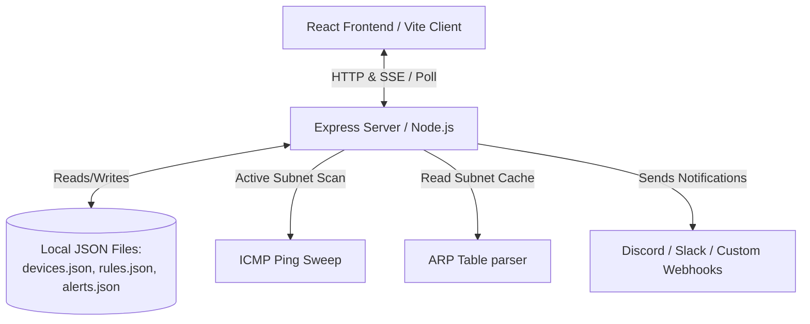

# LAN Device Inventory & Sentry

A self-hosted, lightweight local area network (LAN) scanning and device inventory dashboard. It provides real-time visibility into local subnet activity, monitors device connections, and fires alert webhooks when state changes occur.

> [!NOTE]
> **AI Assistance Disclosure**: This project was developed with AI assistance. The application structure, backend polling systems, and modern React dashboard layout were co-authored with AI coding assistants.

---

## Key Features

- **Subnet Scanning & Discovery**: Periodically performs active ICMP subnet pings and inspects system ARP tables (`/proc/net/arp`) to discover active hosts and record response latencies.
- **Persistent Device Registry**: Keep track of all devices on your local network. Organize hosts with custom nicknames, notes, vendors, and device types (e.g., IoT, workstation, mobile, server).
- **mDNS Broadcast Monitoring**: Features concepts of local multicast DNS monitors to track hostname updates.
- **Connection Alert Rules**: Establish alerts for network events, such as when a new unknown device is discovered, a critical device goes offline, or a device's DHCP IP address mapping changes.
- **Notification Webhooks**: Out-of-the-box integration with platforms like **Discord** and **Slack**, plus support for custom webhooks to receive instant notifications about network status updates.
- **Modern Responsive Dashboard**: Built with React, Tailwind CSS, Vite, Lucide Icons, and Framer Motion, offering dynamic theme accent colors, customizable UI densities (compact or comfortable), audio alert options, and real-time status stats.

---

## Architecture Overview



The application runs as a unified server:
1. **Frontend**: A React single-page application built on Vite and Tailwind CSS.
2. **Backend**: An Express server written in TypeScript (`server.ts`) that manages background network scanning intervals (ARP sweeping and ICMP pings), serves API endpoints, and triggers webhooks.

---

## Getting Started

### Prerequisites
- **Node.js** (v18.x or newer recommended)
- **Linux/Unix environment** (for full ARP table features under `/proc/net/arp`; falling back to simulated MAC addresses in other OS environments)

### Installation

1. Install the required Node packages:
   ```bash
   npm install
   ```

2. (Optional) Create a `.env` file to customize settings based on [.env.example](.env.example):
   ```bash
   cp .env.example .env
   ```

### Running the Application

- **Development Mode** (Vite Dev Server with HMR):
  ```bash
  npm run dev
  ```
  The app will start and be available at `http://localhost:3000` (or your configured `PORT`).

- **Production Build**:
  1. Build the production assets and bundle the server:
     ```bash
     npm run build
     ```
  2. Start the production server:
     ```bash
     npm start
     ```

- **Standalone Executable Compilation**:
  If you wish to compile LAN Sentry into a single `.exe` file that users can download and run without Node.js, please see the [COMPILE.md](COMPILE.md) instructions.

---

## License

This project is licensed under the [MIT License](sentry-version.json).
